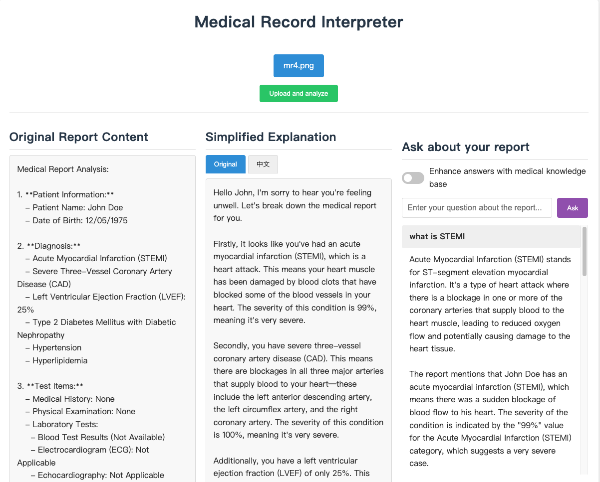
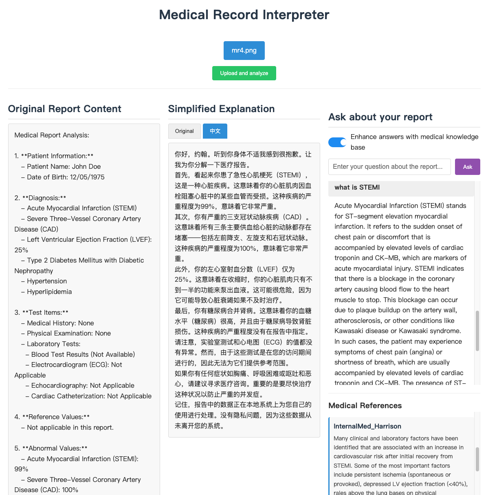
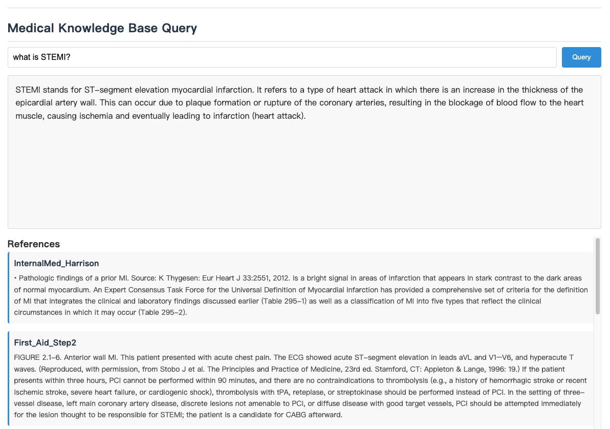

# Medical Report Interpreter

# v1.1 Updates:
- Add Español support.
- Removed direct database queries.
- Fixed Windows compatibility.

## Overview
**Medical Report Interpreter** is an **on-device AI** application built with FastAPI. It enables users to upload medical report images, extract structured text, provide user-friendly explanations, and support translation and Q&A functionalities. The system runs entirely **locally**, ensuring privacy and security. It integrates **LMStudio** for local AI processing using the **Qwen2-VL-2B-Instruct** model.






## Project Structure
```
medical-report-interpreter/
│
├── app/
│   ├── main.py                  # FastAPI main application
│   ├── models/
│   │   ├── lm_handler.py        # Handles LMStudio API interactions
│   │   ├── rag_handler.py       # Handles RAG integration
│   │   └── medrag/              # MedRAG core functionality
│   │       ├── medrag.py        # Simplified MedRAG implementation
│   │       └── utils.py         # MedRAG utility functions
│   ├── services/
│   │   ├── report_service.py    # Medical report processing service
│   │   ├── file_service.py      # File handling service
│   │   └── rag_service.py       # RAG functionality service
│   └── utils/
│       └── helpers.py           # Helper functions
│
├── corpus/                      # RAG corpus directory
├── scripts/                      # Utility scripts
│   └── build_rag_index.py       # Script to pre-build RAG indexes
│
├── static/                      # Frontend assets
├── templates/                   # HTML templates
├── uploads/                     # Uploaded file storage
│
├── .env                         # Environment variables
├── requirements.txt             # Project dependencies
└── README.md                    # Project documentation
```

## How to Set Up LMStudio
1. **Download and Install LMStudio**
   - Get LMStudio from: [https://lmstudio.ai](https://lmstudio.ai)

2. **Load the Model**
   - Download **Qwen2-VL-2B-Instruct** from Hugging Face.
   - In LMStudio, load `Qwen2-VL-2B-Instruct` and ensure it is running on port `1234`.

3. **Configure LMStudio for Local API Access**
   - Go to `Settings` in LMStudio.
   - Enable `Local API` and set the endpoint to `http://localhost:1234/v1/chat/completions`.

## How to Run

### 1. Set Up Virtual Environment

It is recommended to use a virtual environment to manage dependencies:

```bash
python -m venv venv
source venv/bin/activate  # On Windows: venv\Scripts\activate
```

### 2. Install Dependencies

Ensure you have Python 3.8+ installed, then run:

```bash
pip install -r requirements.txt
```

### 3. Start the Application

```bash
python -m app.main
```

### 4. First-Time Initialization

When running the **Medical Report Interpreter** for the first time, the system performs the following steps:

- **Downloading the Medical Corpus**: The application clones the **textbook corpus** from Hugging Face into `./corpus/textbooks/`.
- **Embedding the Corpus**: The system **embeds** the textbooks using the **ncbi/MedCPT-Article-Encoder** model and downloads precomputed embeddings if necessary.
- **Indexing the Corpus**: The system processes and indexes the embedded data for retrieval.
- **Loading Sentence-Transformers Model**: If the `ncbi/MedCPT-Query-Encoder` model is not found, a new one is initialized with **CLS pooling**.
- **Starting the FastAPI Server**: The system launches the FastAPI server at `http://0.0.0.0:8000`.

### 5. Access the Web Interface

Open the following URL in a browser:

```
http://localhost:8000
```

### 6. Upload and Analyze a Medical Report

- Navigate to the home page and upload a medical report image (`.jpg`, `.jpeg`, `.png`).
- The system will extract text and structure, providing an explanation of medical terms.

### 7. Translation

- Click the **Translate** button to convert the explanation into another language (default: Chinese).

### 8. Ask Medical Questions

- Enter a question related to the extracted report content and receive AI-generated answers.
- Enable **RAG (Retrieval-Augmented Generation)** to enhance explanations with relevant medical literature.

### 9. API Endpoints

You can interact with the system via API:

- **`POST /upload`** – Upload a medical report image for analysis.
- **`POST /translate`** – Translate extracted report content.
- **`POST /ask`** – Ask medical-related questions based on extracted data.
- **`POST /rag-enhance`** – Enhance medical explanations using RAG.
- **`POST /rag-ask`** – Directly query the medical knowledge base with RAG.

## Future Work
### 1. **Runtime**
- Migrate from LMStudio's local LLM API to **ONNX Runtime**, enabling more efficient execution and compatibility with different hardware, including **Snapdragon-based** devices.

### 2. Functionality Enhancements
- Expand translation support to **more languages** beyond Chinese.
- (Optional)Implement **local storage** for user history to enable further retrieval and personalized interactions.
- (Optional)Support voice input and output, allowing users to interact via speech recognition and text-to-speech synthesis.


### 3. Model Improvements
- Refine the prompt to ensure more accurate and relevant explanations and responses.
- Utilize a **domain-specific fine-tuned model** for improved medical interpretation, Q&A, and translation.
- (Optional)Replace **Qwen2-VL-2B-Instruct** with a **larger and more powerful model**, if resources allow, to enhance processing accuracy.

### 4. Frontend & Backend Enhancements
- Improve the **frontend UI/UX** to provide a more intuitive and visually appealing experience.

### 5. Testing & Evaluation
- Use **real medical report images** to improve model evaluation and ensure accuracy.
- (Optional)Develop a robust testing framework for systematic model validation and debugging.
