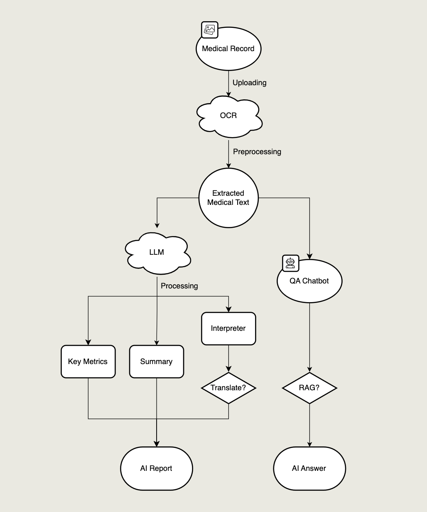

# Medical Expert - AI-Powered Medical Report Interpreter

## Overview

**Medical Expert** is an innovative AI-driven application designed to help users understand complex medical reports. It leverages advanced machine learning technology to translate professional medical terminology into easy-to-understand explanations, enabling patients to better comprehend their health conditions. The system runs entirely **locally**, ensuring privacy and security of sensitive medical information.


## Project Structure



## Key Features

### 📄 Medical Record Upload & Analysis
- Supports medical reports in FJPG, PNG formats
- Quickly processes and extracts key information from reports
- Handles files up to 10MB in size

### 📊 Key Health Metrics Visualization
- Intuitively displays key health indicators (such as cholesterol, blood glucose, etc.)
- Uses a color-coding system (green, yellow, red) to mark normal, borderline, and abnormal values
- Clearly shows the normal range and current value for each indicator

### 📝 AI Interpretation Engine
- Translates complex medical terminology into easy-to-understand explanations
- Provides context and meaning for health data
- Highlights abnormal values that need attention

### 🌐 Multi-language Support
- Offers translation of medical explanations into multiple languages
- Currently supports English, Chinese, and Spanish
- Caches translation results for improved performance

### 💬 Intelligent Medical Assistant
- Interactive chatbot answers questions about medical reports
- Supports RAG (Retrieval-Augmented Generation) mode for more accurate answers
- Includes reference sources to enhance credibility

### 🔒 Privacy & Security
- HIPAA-compliant data encryption and security measures
- On-device AI processing ensures privacy protection
- Protects users' sensitive medical information

## Technical Architecture

### Backend
- **FastAPI** framework for the backend API
- **LMStudio** integration for local AI processing using **Qwen2-VL-2B-Instruct** model
- Medical report processing services and AI-powered text extraction

### Frontend
- **React + Vite** for UI development
- Custom UI Components: Card, MatricCard, Markdown rendering components
- RESTful API integration with the backend services

## Project Structure

```
medical-expert/
├── backend/
│   ├── app/
│   │   ├── main.py          # FastAPI application entry point
│   │   ├── models/          # Data models and AI handlers
│   │   │   ├── lm_handler.py    # LMStudio API interactions
│   │   │   ├── medrag/          # Medical RAG implementation
│   │   │   └── medical_metrics.json  # Reference health ranges
│   │   ├── services/        # Business logic services
│   │   │   ├── report_service.py  # Report processing service
│   │   │   ├── file_service.py    # File handling operations
│   │   │   └── rag_service.py     # RAG enhancement service
│   │   └── utils/           # Helper utilities
│   ├── static/              # Static assets for web interface
│   │   ├── css/             # Stylesheet files
│   │   └── js/              # JavaScript files
│   ├── templates/           # HTML templates
│   ├── uploads/             # Storage for uploaded files
│   ├── corpus/              # Medical knowledge corpus for RAG
│   ├── scripts/             # Utility scripts
│   ├── Dockerfile           # Container definition
│   ├── requirements.txt     # Python dependencies
│   └── README.md            # Backend documentation
│
├── frontend/
│   ├── public/              # Public static assets
│   ├── src/
│   │   ├── api/             # API client and service calls
│   │   ├── assets/          # Static assets (images, icons)
│   │   ├── components/      # Reusable UI components
│   │   │   ├── Card.jsx     # Generic card component
│   │   │   ├── Chatbot.jsx  # Interactive medical assistant
│   │   │   ├── Layout.jsx   # Main layout structure
│   │   │   └── MetricsCard.jsx  # Health metrics visualization
│   │   ├── pages/           # Page components
│   │   │   ├── HomePage.jsx # Landing page with file upload
│   │   │   └── ResultPage.jsx  # Analysis display page
│   │   ├── routes/          # Routing configuration
│   │   ├── styles/          # Global styles and theme definitions
│   │   ├── utils/           # Helper functions and utilities
│   │   ├── App.jsx          # Main application component
│   │   └── main.jsx         # Entry point
│   ├── package.json         # Frontend dependencies
│   ├── vite.config.js       # Build configuration
│   ├── index.html           # HTML template
│   └── README.md            # Frontend documentation
│
└── README.md                # Project overview and setup guide

```

## Setup Instructions

### Backend Setup

#### 1. Set Up LMStudio
1. **Download and Install LMStudio**
   - Get LMStudio from: [https://lmstudio.ai](https://lmstudio.ai)

2. **Load the Model**
   - Download **Qwen2-VL-2B-Instruct** from Hugging Face
   - In LMStudio, load `Qwen2-VL-2B-Instruct` and ensure it is running on port `1234`

3. **Configure LMStudio for Local API Access**
   - Go to `Settings` in LMStudio
   - Enable `Local API` and set the endpoint to `http://localhost:1234/v1/chat/completions`

#### 2. Set Up Backend Environment

1. **Create and activate a virtual environment**:
   ```bash
   python -m venv venv
   venv\Scripts\activate

   # On Mac: source venv/bin/activate  
   ```

2. **Install dependencies**:
   ```bash
   cd back-end
   pip install -r requirements.txt
   ```

3. **Start the backend server**:
   ```bash
   python -m app.main
   ```
   The backend API will be available at `http://localhost:8000`

#### Option 2: Using Docker (Recommended for Deployment or Isolation)

1. Make sure you are in the project root directory (where the `Dockerfile` is located).

2. Build the Docker image:

   ```bash
   docker build -t medical-report-interpreter .
   ```

3. Run the Docker container:

   ```bash
   docker run -p 8000:8000 --network="host" medical-report-interpreter
   ```

   > 💡 On macOS or non-Linux systems, you may omit the `--network="host"` option:

   ```bash
   docker run -p 8000:8000 medical-report-interpreter
   ```

4. Once running, the backend API will be available at [http://localhost:8000](http://localhost:8000).


### Frontend Setup

1. **Install dependencies**:
   ```bash
   cd front-end
   npm install
   ```

2. **Start the development server**:
   ```bash
   npm run dev
   ```

3. **Build for production**:
   ```bash
   npm run build
   ```

## Using the Application

1. Launch both backend and frontend servers
2. Open the frontend application in your web browser
3. Upload a medical report image (JPG, PNG) or PDF
4. View the extracted information, AI-generated explanations, and metrics
5. Use the translation feature to view explanations in your preferred language
6. Ask specific questions about your medical report using the chatbot

## API Endpoints

The backend provides the following API endpoints:

- **`POST /upload`** – Upload a medical report image for analysis
- **`POST /translate`** – Translate extracted report content
- **`POST /ask`** – Ask medical-related questions based on extracted data

## Future Work

### 1. Runtime Enhancements
- Migrate from LMStudio's local LLM API to **ONNX Runtime** for more efficient execution
- Optimize for compatibility with different hardware, including **Snapdragon-based** devices

### 2. Functional Improvements
- Implement **local storage** for user history to enable retrieval and personalized interactions
- Enhance RAG (Retrieval-Augmented Generation) capabilities
- Expand translation support to more languages
- Add voice input/output for accessibility

### 3. Model Upgrades
- Explore larger and more powerful models for enhanced accuracy
- Implement domain-specific fine-tuned models for improved medical interpretation
- Continue refining prompts for more accurate and relevant responses

### 4. UI/UX Enhancements
- Improve the frontend interface for a more intuitive user experience
- Enhance visualization of medical data
- Implement responsive design for mobile devices

### 5. Testing & Validation
- Conduct comprehensive testing with real medical report images
- Validate accuracy of interpretations with medical professionals

## Contribution Guidelines

Contributions of code, issues, or suggestions are welcome! Please fork the repository and submit a pull request.

## License

MIT License

## Contact

For questions or suggestions, please contact us through the project issues.

---

**Medical Disclaimer**: The information provided by Medical Expert is for reference only and does not constitute medical advice. Important health decisions should always be made in consultation with qualified healthcare professionals.
